# 1. PROJECT (Job Search and Analysis System):
Job Search and Analysis Platform is a system which fetches data from various job posting platforms like LinkedIn, GlassDoor, Indeed etc. It extractes the useful information for example, job details, salaries offered, location of job, job types, company ratings and related departments. The system also gets information from Developer Community platforms like StackOverflow so that Buisness Analytics team can estimate which job is saturating and which needs more skilled workers. This system can also perform geo based analysis i.e. which country/city is offering most jobs and in which sector.

## 2. Data Resources:
In this pipeline we are using the following data resources:<br>

<p align="center">

</p>

1. **LinkedIn** (https://www.kaggle.com/joshmantovani/data-science-jobs)
<br> <i>df_all_linkedin.csv</i> contains the info:<br>
<p align="left">
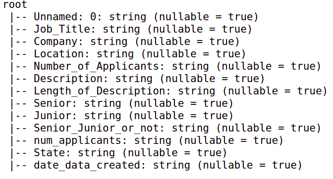
</p>
2. **Indeed** (https://www.kaggle.com/joshmantovani/data-science-jobs)
<br> <i>df_all_indeed.csv</i> contains the info:<br>
<p align="left">
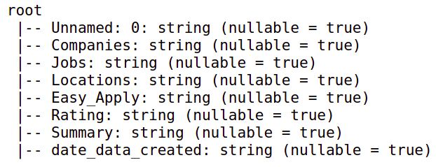
</p>
3. **Glassdoor** (https://www.kaggle.com/rkb0023/glassdoor-data-science-jobs)
<br> <i>df_all_glassdoor.csv</i> contains the info:<br>
<p align="left">
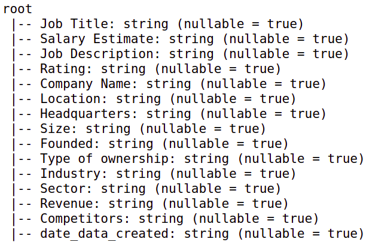 
</p>
4. **StackOverflow** (https://www.kaggle.com/stackoverflow/stack-overflow-2018-developer-survey)
<br> <i>
survey_results_public.csv</i> contains information about developers on StackOverflow. It has 129 columns with various useful info like his hobbies, skillset, education, employment etc.<br>

## 4. Choice of Tools and Technologies:
In order to explain the choice of tools and technologies for this project it is important to understand the data resources.

1. Data Resources are not limited to LinkedIn, Indeed, Glassdoor or StackOverflow. As the project grows further we will be adding more data sources like monster.com or frm other job info platforms.
2. Each of these resources have a complex schema with raw data that needs extensive processing and cleaning. 

Both of the above 2 points can be much easily cater by the **PySpark**. With spark architecture we can deal with heavy loads of data, pre-processing and cleaning because of Lazy Evaluation. It also has an NLP based packages that can help in text processing. Also as soon as we need more computation we can just increase the slave nodes.

**S3** will acts as our staging platform as well as a permanent storage for the data coming from multiple resources. S3 is a cheap storage and will be best to use in this data extensive pipeline.

**Redshift** will be used to shift processed data  by PySpark to corresponding tables. This way Business Analytics team can easily use OLAP queries on those tables. 

**Airflow** will play a very important role in keeping our data stores updated. Each day we get thousands of jobs update in platforms like LinkedIn, Glassdoor etc. Airflow will make sure that we maintain most recent data in our data stores.


## 3. Project Flow:
The project is divided into multiple modules:<br>

1. **ARCHITECTURE**:
<p align="center">
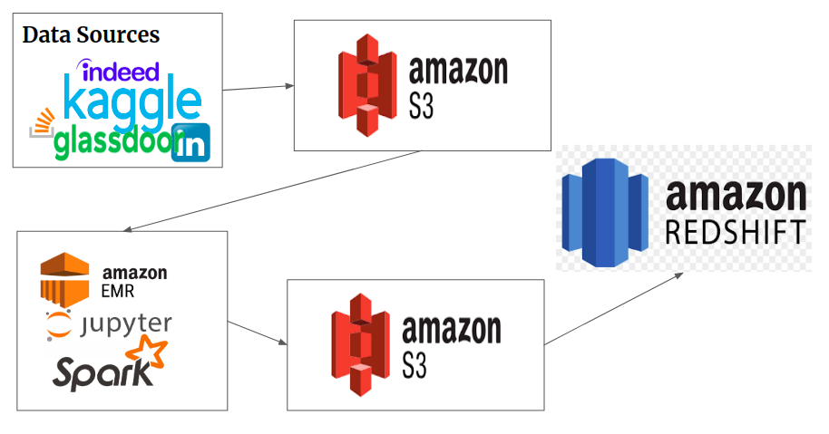
</p>

2. **Fetch Resources**:
<br> Currently, data is being downloaded from all these 4 resources and then moved towards the company dedicated storage on **S3**. We have maintained a bucket named <i>jobs-bucket</i> where multiple directories are available for data fetching and writing.
    1. LinkedIn data is uploaded to <a>s3://jobs-bucket/jobs_linkedin/</a>
    2. Glassdoor data is uploaded to <a>s3://jobs-bucket/jobs_glassdoor/</a>
    3. Indeed data is uploaded to <a>s3://jobs-bucket/jobs_indeed/</a>
    4. StackOverflow data is uploaded to <a>s3://jobs-bucket/stackoverflow/</a>
<br><br>In each of these soruces an additional columns is added **date_data_created**. This column contains the date when each time a data is downloaded form these sources.


3. **Data Lake**:
<br> Data Lake module majorly plays the role in interacting with the raw files coming from all the 4 sources. There are four transformers available in `data_lake` directory:
    1. GlassdoorJobs
    2. IndeedJobs
    3. LinkedInJobs
    4. StackOverflowDev

Each of these 4 transformer extracts useful information from **S3** bucket and generates 7 useful structures:

* Job_Details:<br>
<p align="center">
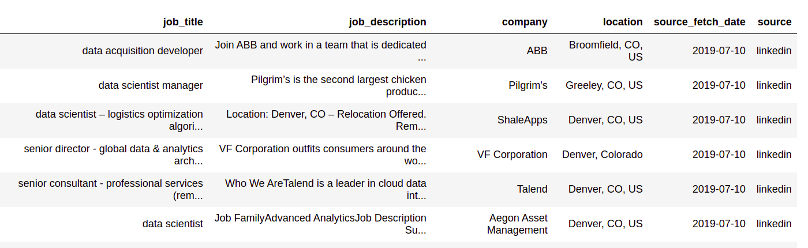
</p>
* Time_Details:<br>
<p align="center">
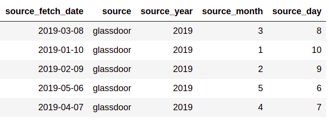
</p>
* Company_Location:<br>
<p align="center">
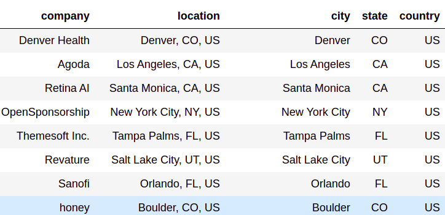
</p>
* Job_Rating:<br>
<p align="center">
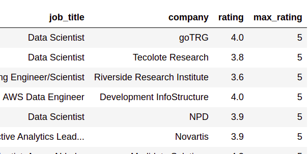
</p>
* Job_Salary<br>
<p align="center">
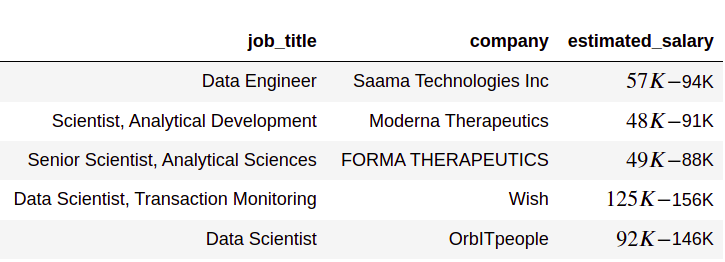
</p>
* Job_Sector<br>
<p align="center">
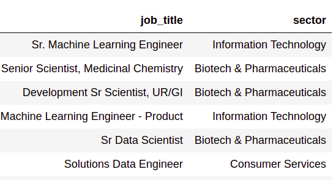
</p>
* Developers<br>
<p align="center">
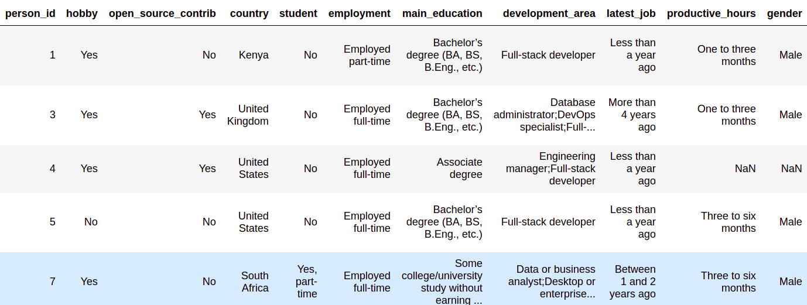
</p>
Each of these files are shift into corresponding **S3** directories

<br>

4. **Shift Data Into Redshift**:
<p>All these files in S3 are then shited to the RedShift Tables.</p>

5. **Data Model**:
<p align="center">
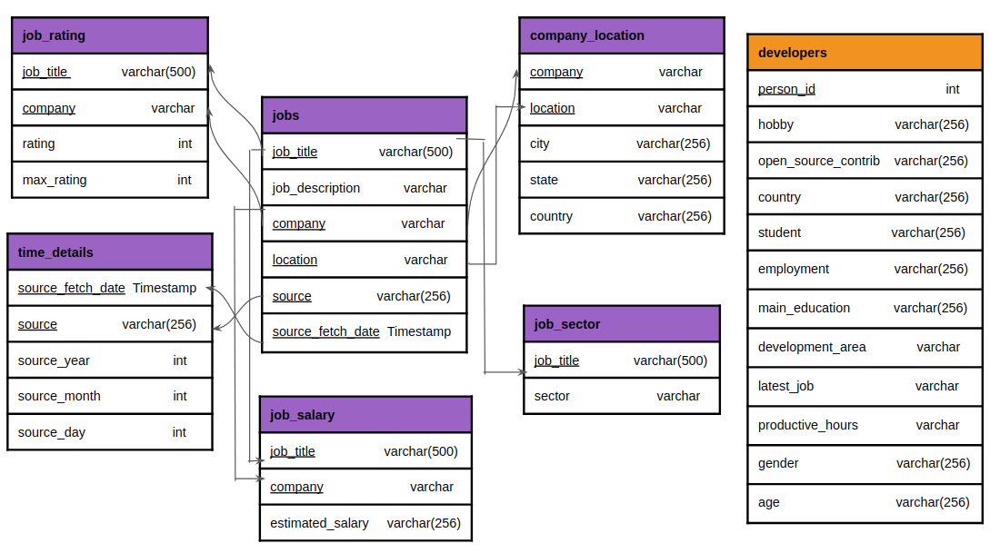
</p>


<br>
## 4. Data Pipeline:
Data Pipeline is available in directory `data_pipeline`. It consists of the following steps:<br>

1. Process Data in Data Lake
2. Create Tables for Business analytics team
3. Move New Data from S3 to the corresponding Tables
4. Perform Data Quality tests

<p align="center">
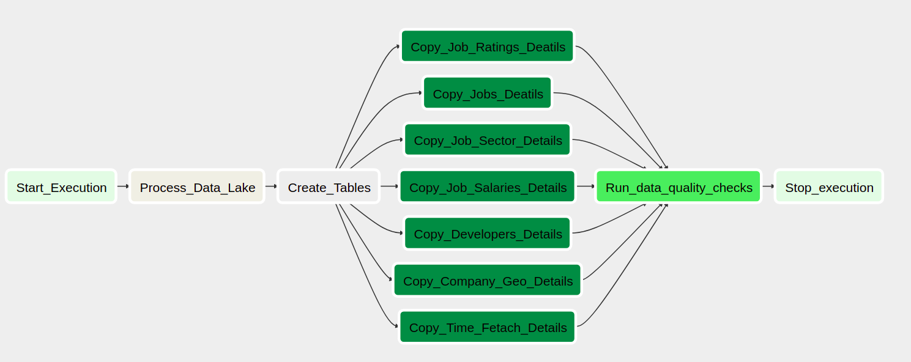
</p>

## 5. Running The Project:
**Create Virtual Environment**
```commandline
# create python virtual environment
$ virtualenv .venv
$ source .venv/bin/activate

# Install Requirements
$ pip install -r requirements.txt
```

**Install Data Lake as a Package**
```commandline
# Do add your AWS credentials in data_lake/lake.cfg first
# make sure you are in the main directory where setup.py exists
$ pip install .

# This will install the package process-data-from-lake
# Run process-data-from-lake to just process data on lake
$ process-data-from-lake
```

**Give airflow script executable permissions**
```commandline
# make sure you are in the main directory where setup.py exists
$ chmod +x script/airflow_start.sh
```

**Running the Project**
```commandline
# make sure you are in the main directory where setup.py exists
# Run the script
$ script/airflow_start.sh
```

**Configurations**
```commandline
# Setup Redshift Connection:
-> Conn Type: Postgres
-> Host: Redshift Database URL
-> Schema: DB_NAME
-> Login: DB_USER
-> Password: DB_PASSWORD
-> Port: DB_PORT

# Setup AWS Connection:
-> AWS_ACCESS_KEY_ID: AWS_Key
-> AWS_SECRET_ACCESS_KEY: AWS_Secret_Access
```


After this go to <a>http://localhost:3001/</a> and run the DAG (jobs_analysis). Make sure to add all the credentials of Redshift and S3 in Admin panel before running the DAG.
